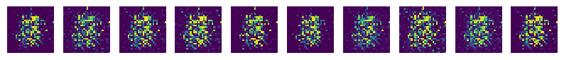

## MNIST dataset


## How to run the code

```bash
$ python3 main.py
```

1. 맨 처음 코드를 작동시킬 경우, 코드는 data 디렉토리를 만들어 MNIST 데이터셋을 다운로드합니다. 

2. 다운로드가 끝나면, 바로 학습이 시작됩니다. 세부 설정은 main.py 내 Configurations에서 확인할 수 있습니다. 초기 설정은 다음과 같습니다:

   ```python
   # Configurations
   N_BATCH = 100			# batch 개수
   N_CLASSES = 10		# class 개수 (0부터 9까지니까 총 10개)
   D_INPUT = 28*28		# discriminator에 넣을 input 사이즈 (이미지 사이즈)
   D_NOISE = 128			# generator에 넣을 noisy input 사이즈
   N_EPOCH = 200			# 학습 회수
   lr = 0.001				# 학습 속도
   ```

3. 매 epoch마다 generator가 만드는 숫자 샘플들을 samples 디렉토리에서 확인할 수 있습니다. 


## Code inside

#### 0. 라이브러리 로드하기

```python
from funcs import onehot, savefig
import torch
from torch import nn
from torch.optim import Adam
from torch.utils.data import DataLoader
from torchvision import transforms, datasets
```

0-1. funcs의 onehot은 label을 one hot vector로 만들어줍니다. 예를 들어 MNIST 숫자 4의 label은 int 값인 4인데, 이 값을 [0, 0, 0, 0, 1, 0, 0, 0, 0, 0]로 바꿔줍니다.

0-2. funcs의 savefig는 학습 중간에 샘플을 뽑아 이미지로 저장할 수 있게 해줍니다.


#### 1. MNIST 데이터 로드하기

```python
# Before downloading MNIST, Images should have specified format from [0,1] to [-1,1]
transform = transforms.Compose([transforms.ToTensor(), transforms.Normalize(mean=(0.5,), std=(0.5,))])
trainset = datasets.MNIST(root='./data', train=True, download=True, transform=transform)
testset = datasets.MNIST(root='./data', train=False, download=True, transform=transform)
trainloader = DataLoader(dataset=trainset, batch_size=100, shuffle=True, num_workers=2)
testloader = DataLoader(dataset=testset, batch_size=100, shuffle=True, num_workers=2)
```

1-1. 하나의 MNIST 이미지는 1채널(greyscale)의 28*28 사이즈입니다. 한 픽셀은 [0, 255] 사이의 값을 가지는데, 아래와 같이 ToTensor()를 사용하면 [0, 1] 사이의 값을 가지게 합니다. 

1-2. 실제 학습에는 [-1, 1] 사이의 값을 가지게 하는 것이 더 좋으므로, Normalize()를 이용해 [-1, 1] 사이로 바꿔줍니다. 

1-3. trainset과 testset에서 직접 데이터를 하나씩 로드해도 괜찮지만, torch.utils.data의 DataLoader를 사용하면 이를 훨씬 편하게 할 수 있습니다. 

1-4. 여기서는 한 batch 당 100개씩 이미지를 불러오도록 했습니다. 

1-5. num_worker는 이미지를 불러올 때 multi-processing과 관련된 값인데, cpu가 충분하다면 값을 올리셔도 좋습니다. 


#### 2. Discriminator와 Generator 만들기

```python
class Discriminator(nn.Module):
    def __init__(self):
        super().__init__()
        self.model = nn.Sequential(
            nn.Linear(28*28 + 10, 512),   # input은 MNIST 그림  + label을 받는다.
            nn.LeakyReLU(0.2, inplace=True),
            nn.Dropout(0.3),
            nn.Linear(512, 1),
            nn.Sigmoid()
        )

    def forward(self, x):
        out = self.model(x)
        return out
```

2-1. Discriminator는 이미지가 진짜 이미지(True image)인지 혹은 Generator가 만든 가짜 이미지(Fake image)인지 판단하는 곳입니다. 

2-2. Discriminator의 첫 레이어는 크기가 28*28(이미지 크기) + 10(0부터 9까지 one hot vector의 크기)인 데이터를 인풋으로 받습니다. 

2-3. Discriminator의 마지막 레이어는 크기가 1인 아웃풋을 주도록 합니다. "이 이미지는 진짜(1), 혹은 가짜(0)야!" 하고 판단하도록 하고싶거든요.


```python
class Generator(nn.Module):
    def __init__(self):
        super().__init__()
        self.model = nn.Sequential(
            nn.Linear(128 + 10, 512),   # input은 Noise + label 을 받는다
            nn.LeakyReLU(0.2, inplace=True),
            nn.Linear(512, 28*28),
            nn.Tanh()
        )

    def forward(self, x):
        out = self.model(x)
        return out
```

2-4. Generator는 노이즈를 받고 Discriminator를 속일 가짜 이미지(Fake image)를 만들어내는 곳입니다.

2-5. Generator의 첫 레이어는 크기가 128(노이즈 크기) + 10(0부터 9까지 one hot vector의 크기)인 데이터를 인풋으로 받습니다.

*(잡담: 어떤 GAN은 one hot vector의 꼬리표를 붙이지 않은 노이즈 데이터만 넣기도 합니다. 이 경우 Generator는 노이즈에 따라서 (거의) 무작위로 숫자를 생성하게 됩니다. 뭐, 사실 그래도 상관 없겠지만, 0부터 9까지 숫자를 원하는 대로 뽑아보고 싶다면 노이즈 끝에 "이 노이즈로 꼬리표에 해당하는 숫자를 만들어줘!"라는 표시로 one hot vector를 붙여야합니다.)*

2-6. Generator의 마지막 레이어는 크기가 28*28인 아웃풋(=이미지)을 주도록 합니다.


```python
# define networks
D = Discriminator()
G = Generator()
```

2-7. 마지막으로, 이제 generator와 discriminator를 정의해줍니다. 


#### 3. loss와 optimizer 선택하기

```python
criterion = nn.BCELoss()
D_optim = Adam(params=D.parameters(), lr=0.001)
G_optim = Adam(params=G.parameters(), lr=0.001)
```

3-1. 우리는 진짜(1) 혹은 가짜(0)을 판단하는 신경망을 사용하기 때문에, BCE (=Binary Cross Entropy) loss를 사용합니다.

3-2. 학습 속도는 적당한 값을 줍니다. 여러 수치를 테스트해봤는데, 여기서는 0.001정도가 적당히 잘 학습하는 것 같았어요.


#### 4. 학습하기

```python
for epoch in range(100):
    for i, (images, labels) in enumerate(trainloader):
        # prepare images, noises for fake images, and real labels.
        images = images.view(-1, 28*28)
        noises = torch.randn(images.size(0), 128)
        labels = onehot(labels, 10)
```


## Results (samples)

*epoch 1: 학습 초기에는 대충 중앙에 숫자들이 분포해있다는 정도만 배운 것 같네요.*



*epoch 50: 0부터 9까지 숫자의 형태를 조금 배운 것 같습니다.*


*epoch 150: 점차 형태가 완성된 숫자들이 나오기 시작합니다.*


*epoch 200: 음... 어떤 것은 나아졌는데, 어떤 것은 오히려 안좋아졌네요! 그래도 대충 숫자는 나오네요.*


## References

[taeoh-kim's blog: tensorflow로 50줄짜리 original gan code 구현하기](https://taeoh-kim.github.io/blog/tensorflow로-50줄짜리-original-gan-code-구현하기/)

