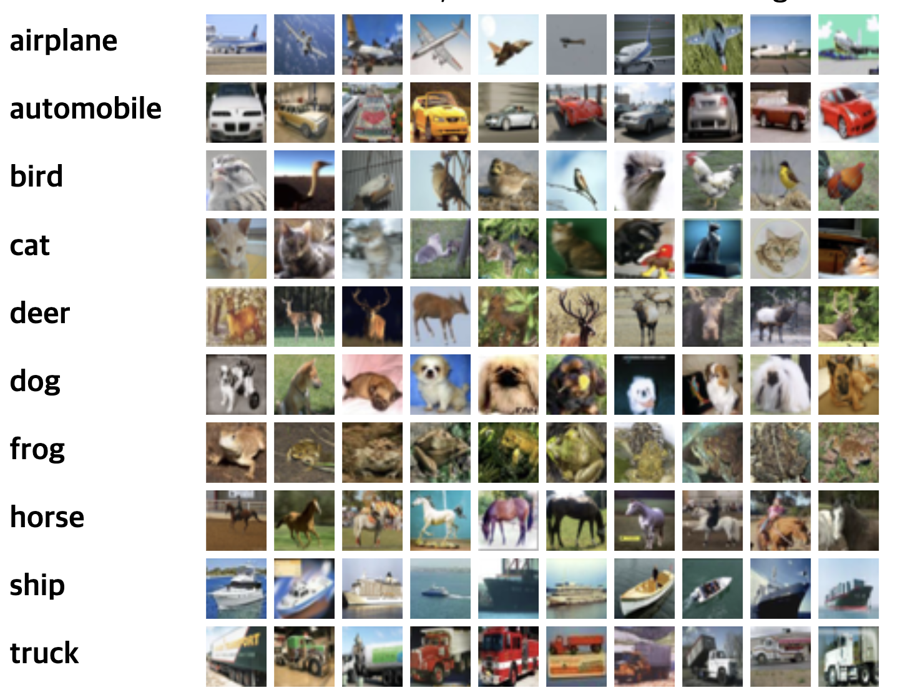

# CNN Cifar10 classifier

## Cifar10 dataset




## How to run the code

```bash
$ python3 main.py
```

1. 맨 처음 코드를 작동시킬 경우, 코드는 data 디렉토리를 만들어 MNIST 데이터셋을 다운로드합니다. 
2. 다운로드가 끝나면, 바로 학습이 시작됩니다. 


## Results


## References

[분류기(Classifier) 학습하기](https://9bow.github.io/PyTorch-tutorials-kr-0.3.1/beginner/blitz/cifar10_tutorial.html#id2)

[Machine Learning Academy_Part V. Best CNN Architecture: 2. LeNet](https://m.blog.naver.com/PostView.nhn?blogId=laonple&logNo=220648539191&proxyReferer=https%3A%2F%2Fwww.google.com%2F)

[CS231n Convolutional Neural Networks for Visual Recognition](http://aikorea.org/cs231n/convolutional-networks/)

[Kernel에 대한 설명 : "What does kernel size mean?"](https://stats.stackexchange.com/questions/296679/what-does-kernel-size-mean/339265)

[Kernel과 Padding에 대한 설명: "A Beginner's Guide To Understanding Convolutional Neural Networks Part 2"](https://adeshpande3.github.io/A-Beginner%27s-Guide-To-Understanding-Convolutional-Neural-Networks-Part-2/)
